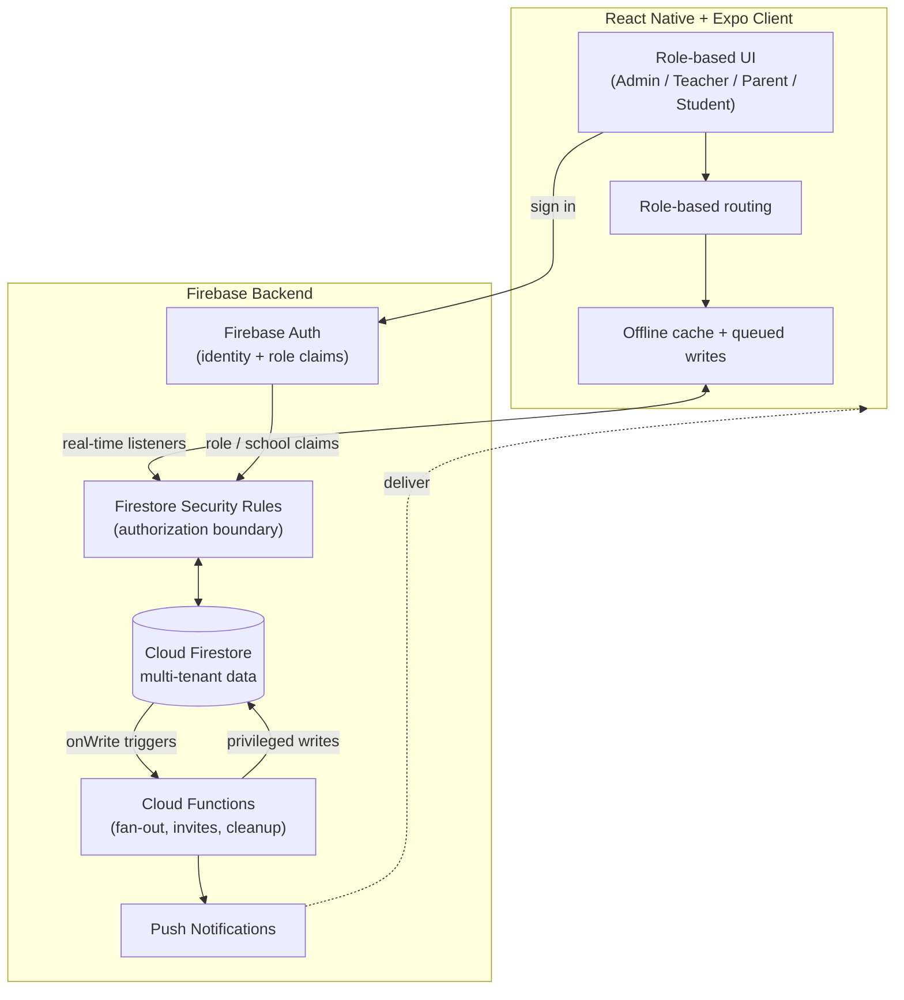
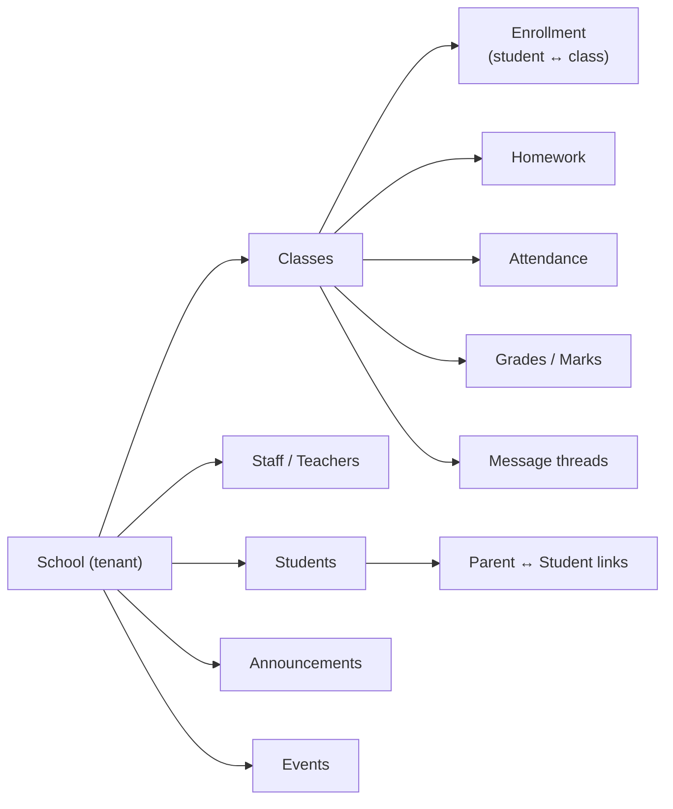
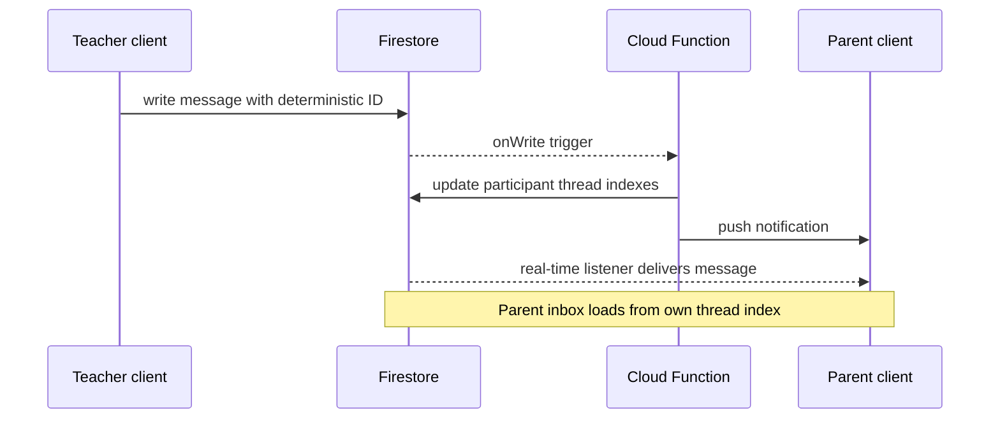

# DugsiConnect

> A school communication and classroom management platform built for schools in Somaliland — replacing fragmented WhatsApp groups and manual paperwork with a structured, role-based, real-time school system.

**Built with React Native · Expo · TypeScript · Firebase Auth · Firestore · Cloud Functions · Security Rules**

---

> **Note on source code**
>
> DugsiConnect is an active commercial product, and its production source code is private. This repository is a public engineering case study. It documents the product, system architecture, data and security model, and engineering decisions behind the app without exposing private source code, Firebase configuration, secrets, customer data, security rules, or internal business logic.
>
> All diagrams and descriptions are intentionally generalized.

---

## Table of Contents

1. [Product Overview](#product-overview)
2. [Problem](#problem)
3. [Solution](#solution)
4. [Tech Stack](#tech-stack)
5. [Core Features](#core-features)
6. [Architecture](#architecture)
7. [Data & Access Model](#data--access-model)
8. [Real-Time Messaging Architecture](#real-time-messaging-architecture)
9. [Security & Permissions](#security--permissions)
10. [Offline & Reliability](#offline--reliability)
11. [Testing](#testing)
12. [Engineering Challenges Solved](#engineering-challenges-solved)
13. [My Role](#my-role)
14. [Status](#status)
15. [Screenshots](#screenshots)

---

## Product Overview

DugsiConnect is a mobile-first platform that structures communication and classroom workflows between **school admins, teachers, parents, and students**.

Each role gets a tailored experience:

- Admins manage their school, classes, staff, and communication flows.
- Teachers manage assigned classes, attendance, homework, grades, announcements, and parent communication.
- Parents stay connected to their own child's school activity.
- Students can access relevant class updates, homework, grades, and announcements.

The product handles the daily operations a school actually runs on: messaging, announcements, attendance, homework, grades, events, and class management — in one structured app instead of disconnected WhatsApp groups, phone calls, and paper records.

---

## Problem

Schools in the target market often coordinate through **WhatsApp groups, phone calls, and manual paper records**. That workflow breaks down quickly as the school grows.

Common problems include:

- **No structured access control** — messages and student updates are not always scoped to the correct parent, student, teacher, or class.
- **Information gets lost** — announcements, homework, and grades disappear inside chat history.
- **No reliable source of truth** — attendance and marks may live in notebooks, spreadsheets, or scattered messages.
- **Weak privacy boundaries** — sensitive student data needs stronger role and relationship-based access.
- **Limited accountability** — schools need a clearer record of what was communicated, to whom, and when.

The core challenge is not simply building a chat app. The harder problem is enforcing **the right data boundary for the right role across many independent schools**, while keeping the app usable on mobile networks that may be slow or intermittent.

---

## Solution

DugsiConnect replaces fragmented school communication with a **structured, multi-tenant school platform**.

The system is designed around:

- A **multi-role access model** for admins, teachers, parents, and students.
- A **multi-tenant data structure** that isolates each school's data.
- **Real-time messaging** scoped to legitimate school relationships.
- **Structured academic workflows** for attendance, homework, grades, announcements, and events.
- **Offline-tolerant behavior** for unreliable mobile network conditions.
- **Backend-enforced authorization** through Firestore Security Rules and Cloud Functions.

Access decisions are enforced at the data layer, not only in the UI. The UI improves usability, but Firestore Security Rules and server-side functions define the actual security boundary.

---

## Tech Stack

| Layer | Technology |
|---|---|
| **Mobile client** | React Native, Expo, TypeScript |
| **Authentication** | Firebase Authentication |
| **Database** | Cloud Firestore with real-time listeners |
| **Authorization** | Firestore Security Rules and role documents/custom claims |
| **Backend logic** | Firebase Cloud Functions |
| **Notifications** | Push notifications with Expo / FCM |
| **Offline behavior** | Firestore offline persistence and app-level queued writes |
| **Testing** | Jest, React Native Testing Library, Firebase Emulator Suite |
| **Language** | TypeScript across client and backend functions |

---

## Core Features

### Administration

- School admin dashboard
- Staff invites and onboarding
- Class management
- Class join codes
- School-wide announcements
- School activity overview

### Teaching

- Teacher dashboard scoped to assigned classes
- Attendance tracking
- Homework assignment and tracking
- Grades / marks entry
- Class announcements
- Parent/student communication

### Communication

- Real-time teacher ↔ parent/student messaging
- Announcement feed
- Events and calendar updates
- Push notifications for messages, announcements, and important updates
- Reported-content / moderation hooks

### Parent / Student

- Parent view scoped to their own child's data
- Student access to relevant classes, homework, grades, and announcements
- Structured communication with teachers and school staff

### Platform

- Role-based routing
- Role-based UI rendering
- Multi-tenant Firestore data model
- Backend-enforced permissions
- Offline-tolerant workflows

---

## Architecture

DugsiConnect uses a **client-driven serverless architecture**.

The React Native app communicates with Firestore through real-time listeners for reads and writes. Cloud Functions handle privileged, multi-document, fan-out, invite, cleanup, and notification workflows that should not be trusted to the client. Firestore Security Rules sit between the client and the database as the authorization boundary.

### Key Principles

- **The client never trusts itself.** The UI hides actions a role cannot perform, but every read and write is independently authorized by Security Rules.
- **Cloud Functions own privileged work.** Operations that cross document boundaries, fan out to many recipients, or require idempotency are handled server-side.
- **Real-time by default.** Listeners keep dashboards, messages, announcements, and classroom updates live without manual refresh.
- **Tenant isolation is explicit.** Every school operates inside its own scoped data boundary.

---

## Data & Access Model

### Multi-tenancy

Every record is scoped to a school tenant. School data is isolated so that a user from one school cannot read or write another school's classes, students, messages, attendance, grades, or announcements.

School scope is derived from the authenticated user's identity and role relationship, not from a client-supplied value that could be tampered with.

### Roles

| Role | Scope of access |
|---|---|
| **Admin** | Manages only their own school: classes, staff, settings, and school-wide announcements |
| **Teacher** | Reads/writes data only for assigned classes: attendance, homework, grades, and messaging |
| **Parent** | Reads only their own child's data: grades, homework, attendance, announcements, and teacher messages |
| **Student** | Reads their own classes, homework, grades, and announcements |

### Conceptual Data Shape

The model is built around relationships:

- teacher ↔ class
- parent ↔ student
- student ↔ class
- message participant ↔ thread

Those relationships are exactly what the security layer checks when authorizing access.

---

## Real-Time Messaging Architecture

Messaging is one of the most read-heavy and latency-sensitive parts of the system, so it is designed for bounded reads instead of naive collection scans.

### Design Goals

- A parent's inbox should load from a small, scoped thread index, not by scanning school-wide messages.
- Message delivery should be idempotent so retries and reconnects do not create duplicates.
- Reads should stay bounded and predictable as schools grow.
- Participants should only see conversations they are authorized to access.

### Approach

**Thread-scoped messages**

Messages live under their conversation thread. Each participant also has a lightweight thread summary containing data such as the last message, unread count, and updated timestamp. Loading an inbox reads the participant's own thread index instead of scanning all messages.

**Fan-out via Cloud Functions**

When a message is sent, a Cloud Function can update each participant's thread index and trigger notifications. The client performs a small write, while server-side logic handles distribution, authorization-sensitive updates, and notification fan-out.

**Deterministic document IDs**

Messages and thread records can use deterministic IDs derived from stable inputs such as participants and message identity. A retried or replayed write targets the same document instead of creating duplicates, which makes offline queues and network retries safer.

**Efficient real-time reads**

Clients subscribe to bounded queries, such as the latest messages in a thread or the user's own thread index, so live conversations do not repeatedly read unnecessary history.

---

## Security & Permissions

Authorization is enforced at the data layer so the rules hold regardless of what client connects.

### Security Model

- **Firestore Security Rules as the source of truth**  
  Every document type has explicit read/write conditions based on the user's identity, role, school, and relationships.

- **Tenant isolation**  
  Rules verify that the requester belongs to the same school as the document. Cross-tenant access is rejected at the database layer.

- **Relationship checks**  
  - A parent can read a student's record only if a verified parent ↔ student link exists.
  - A teacher can read/write class data only for classes they are assigned to.
  - An admin can manage resources only inside their own school.

- **Server-enforced privileged operations**  
  Staff invites, role assignment, join-code redemption, message fan-out, and cleanup workflows are handled through Cloud Functions.

- **Moderation hooks**  
  Reported-content workflows provide a path to review messaging abuse or inappropriate communication.

Actual rule definitions and Firebase configuration are part of the private production repository and are intentionally not published here.

---

## Offline & Reliability

The app is designed for intermittent and low-bandwidth mobile networks.

### Reliability Features

- **Offline persistence**  
  Firestore's local cache keeps previously loaded data available and allows the UI to hydrate quickly.

- **Queued writes**  
  Important user actions, such as sending a message or marking attendance, can be queued locally and reconciled when the device reconnects.

- **Idempotent writes**  
  Deterministic document IDs reduce duplicate-write risk when a queued write is retried after a flaky connection.

- **Network recovery**  
  The app re-establishes listeners and flushes pending writes after reconnection.

- **Cleanup and archival**  
  Background routines can archive stale conversations and aged school data to keep active reads small and predictable over time.

---

## Testing

Testing focuses on the areas most likely to break a school platform: role-based UI behavior, business logic, and authorization.

### Testing Strategy

- **Unit and component tests**  
  Jest and React Native Testing Library cover core logic, hooks, and role-based UI rendering.

- **Security Rules tests**  
  Firebase Emulator Suite tests validate authorization behavior directly:
  - A parent cannot read another child's grades.
  - A teacher cannot write to an unassigned class.
  - A user from School A cannot access School B's data.
  - A student cannot modify records they should only read.

- **Cloud Function tests**  
  Fan-out and privileged operations are validated against emulator-based test scenarios, including idempotency checks.

The emulator-based approach treats the access-control layer as code under test, not as passive configuration.

---

## Engineering Challenges Solved

### 1. Four-role access model

Built a role-based access system across admins, teachers, parents, and students, with consistent enforcement in routing, UI, Firestore Security Rules, and Cloud Functions.

### 2. Multi-tenant school isolation

Designed the data model so many independent schools can share the same backend infrastructure without leaking data across tenants.

### 3. Efficient parent inbox reads

Used participant-scoped thread indexes so parent inbox reads remain bounded instead of growing with total school message volume.

### 4. Idempotent message delivery

Used deterministic write patterns so retries, reconnects, and queued offline writes do not produce duplicate messages.

### 5. Safe server-side fan-out

Moved message distribution, thread index updates, and notifications into Cloud Functions instead of trusting clients to perform privileged multi-document updates.

### 6. Offline-tolerant workflows

Designed messaging, attendance, and classroom actions to remain usable under unstable network conditions and reconcile safely after reconnect.

### 7. Privacy-aware relationship checks

Modeled parent-child, teacher-class, and student-class relationships so access decisions match real school boundaries.

---

## My Role

I designed and built DugsiConnect end-to-end as the product's React Native / Firebase engineer.

Responsibilities included:

- React Native + Expo + TypeScript mobile development
- Role-based navigation and role-specific UI
- Multi-tenant Firestore data modeling
- Firebase Authentication flow design
- Firestore Security Rules strategy
- Cloud Functions for message fan-out, staff invites, join-code flows, and cleanup workflows
- Real-time messaging architecture
- Offline-tolerant queue and network recovery behavior
- Push notification integration
- Testing strategy for client logic, security rules, and backend functions
- Product workflow design for admins, teachers, parents, and students

---

## Status

- **Stage:** Active commercial product
- **Source code:** Private production repository
- **This repository:** Public engineering case study only

Representative roadmap areas:

- Expanded school analytics and activity reporting
- Improved moderation tooling
- Continued performance and archival work as schools scale
- Better onboarding flows for schools, teachers, and parents

---

## Screenshots

Screenshots are illustrative of the product experience. Sensitive data should be redacted or mocked before publishing.

| Screen | Preview |
|---|---|
| Admin dashboard | `[Add screenshot here]` |
| Teacher dashboard | `[Add screenshot here]` |
| Real-time messaging | `[Add screenshot here]` |
| Announcements feed | `[Add screenshot here]` |
| Attendance | `[Add screenshot here]` |
| Homework & grades | `[Add screenshot here]` |
| Parent view | `[Add screenshot here]` |
| Class join code / staff invite | `[Add screenshot here]` |

---

This README documents the engineering behind a private production application. It intentionally omits source code, Firebase configuration, credentials, customer data, and internal business logic.
